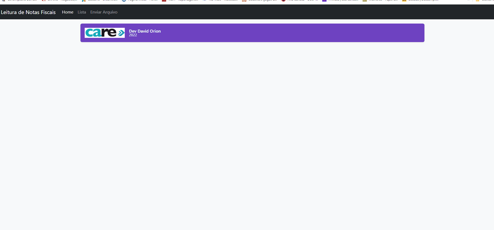
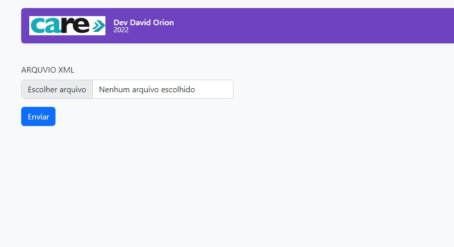
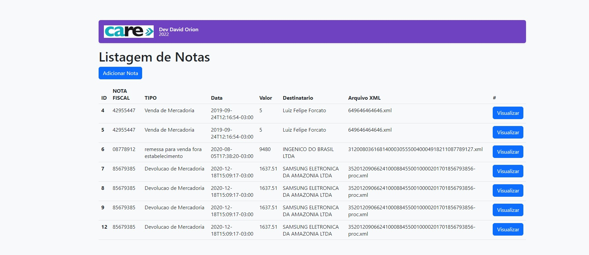

<h1 align="center">
 
  
 
 
Leitura de Nota fiscal em XML
</h1>

Sistema de cadastro de Usuarios e Contatos 

  

  

 
  
  
   

  

   

## Tecnologia usada

Usado do modelo de framework Visual studio, padrão MVC

- ⚛️ **ASP** — ASP classico para servidor windows
-  💹 **C#** — para framework visual studio 2020
-  💹 **C#** — Banco de dados Sql server

## Modelos

1. Hospedado GITHUB 

### Equipe de desenvolvimento

1. David orion (developer)

